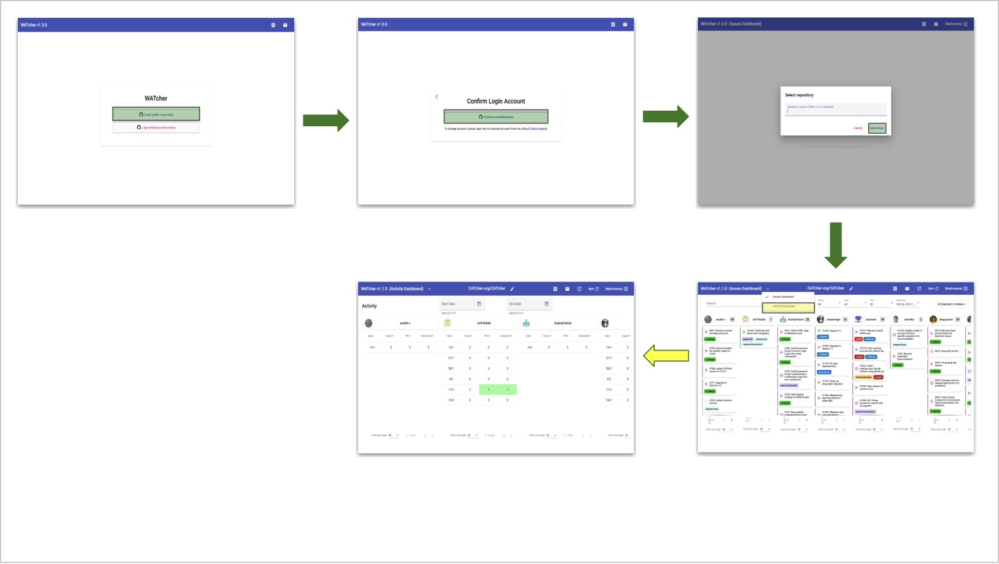
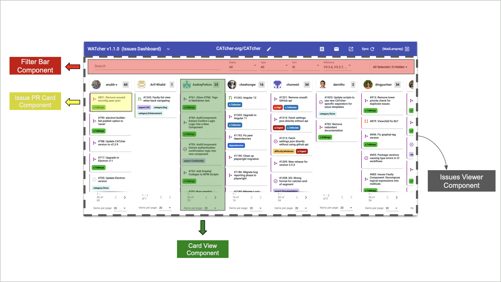

<frontmatter>
  header: header.md
  title: "DG: Design"
  pageNav: 2
  siteNav: dg-nav.md
  footer: footer.md
</frontmatter>

# Design

As described in the [_Tools_](tools.md) section, WATcher is an Angular application that is distributed as a web app.

This page describes WATcher's design. As an Angular application, the different
views of the WATcher app are built out of **components**, and the content displayed on these
views is constructed using data provided by **services**. In the following sections we will briefly describe the design of some views and services within WATcher.

## Views

There are primarily only two views accessible by the user - the Issues Dashboard and the Activity Dashboard.

The diagram below shows how a user can navigate between the different views.

Each view is built out of components. As an example, the following diagram deconstructs the Issues Viewer component, which is the main component for the Issues Dashboard, to show how it is built using several smaller components. For instance, the `Card-viewComponent`, a child component of `IssuesViewerComponent`, is responsible for displaying PRs/issues of each user.

## Services

Services are classes that define business logic or communicate with the app's backend (GitHub). For ease of understanding, we have distinct services for the different types of data exchanged with the backend. Below are some examples:

- `IssueService`: Responsible for fetching issues from GitHub.
- `AuthService`: Responsible for initiating the authentication process, and querying / updating application state related to authentication.
- `LabelService`: Responsible for retrieval and parsing of label data from GitHub repository for WATcher.

Under the hood, several services use the `GitHubService` to communicate with GitHub.
The `GitHubService` abstracts the details of communication with GitHub, away from the other services.
