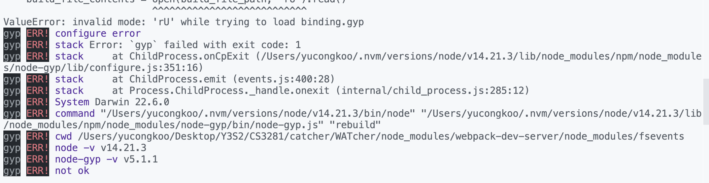

<frontmatter>
  header: header.md
  title: "DG: Setting up"
  pageNav: 2
  siteNav: dg-nav.md
  footer: footer.md
</frontmatter>

# Setting up

This section guides you through the steps required to set up your computer for developing WATcher.

## Getting started

**Prerequisites:**

* [Node.js 14](https://nodejs.org/en/blog/release/v14.21.2/) -- (run `node -v` in your OS terminal to check the version of Node on your computer)

**Recommended:**

* IDE: Visual Studio Code

**Steps:**

1. Fork this repository into your Github account.
2. Clone the forked repository into your computer.
3. Install dependencies with npm: Run `npm install`
    * *a list of warnings on outdated dependencies is to be expected and no action needs to be taken before proceeding.*
4. Compile and start the application in browser: Run `npm run ng:serve:web`.

-----------------------------------------------------------------------------------

## Possible error faced when serving WATcher locally

**You may safely skip this section if you didn't run into the following error when serving locally.**

**Error breakdown:**

This is a known error when serving on MacOS with a python of version >= 3.11, caused by the following:
- There is a `node-gyp` library that is used by `Node.js` to build and compile native modules that contain C++ code.
- For older versions of `Node.js` (including Node 14 that WATcher is using), the source code of the `node-gyp` library, that is written in python, is not compatible with python version >= 3.11
- For detailed information, read [this](https://stackoverflow.com/questions/74715990/node-gyp-err-invalid-mode-ru-while-trying-to-load-binding-gyp) stackoverflow thread

**Possible workaround**
- Alternative 1: Use a python of version <= 3.10 (e.g. by using conda environments). This is the preferred and easier workaround.
- Alternative 2: Manually modify the source code generated for the `node-gyp` library (under `node_modules`) and remove the "U" mode when opening files. You will probably have to follow the linked stackoverflow thread above to know how to use this workaround.

-----------------------------------------------------------------------------------

## Dev commands

Given below are different commands you can use to run the app locally.

|Command|Description|
|--|--|
|`npm run ng:serve:web`| Start the app from the browser in development mode. |
|`npm start`| Start the app from Electron in development mode. |

*Note that our development focus is mainly on Web-version and Electron is served as a backup plan when web version fails. You are encouraged to start working with Web version as a beginner first.*

-----------------------------------------------------------------------------------

## Debugging

If you are using Visual Studio Code to debug WATcher with Chrome, Firefox or Edge.
Refer to the `Debugging Angular` section of [this guide](https://code.visualstudio.com/docs/nodejs/angular-tutorial#_debugging-angular) for a step-by-step walkthrough of the debugger setup.

In summary, the following steps are needed:

1. Install the `Debugger for Chrome` extension for VS Code. You can also install debugger extensions for Firefox and Edge.
1. Create VS Code's debugger config file (`launch.json` ) as shown in [the guide](https://code.visualstudio.com/docs/nodejs/angular-tutorial#_debugging-angular). Particularly, set the `url` attribute to `http://localhost:4200` (reason: WATcher app is served locally on port 4200, by default.)
1. In the root project folder, run `npm run ng:serve:web`.
1. In VS Code's Debug View, launch the debugger by clicking the green arrow (or F5). You should see the WATcher app loading within a new browser window.

-----------------------------------------------------------------------------------

## Writing Documentation

**WATcher documentation is hosted in a separate repo** [CATcher-org/WATcher-doc](https://github.com/CATcher-org/WATcher-doc).
When you need to update documentation, you'll need to fork and clone that repo to your computer as well.

**We use [MarkBind](https://markbind.org/) for documentation**. Follow [this tutorial](https://se-education.org/guides/tutorials/markbind.html) to learn how to use MarkBind for updating project documentation.

-----------------------------------------------------------------------------------
