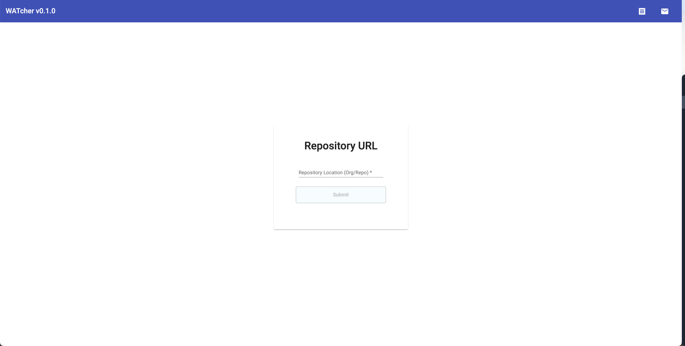

<frontmatter>
  header: header.md
  title: "UG: for students"
  pageNav: 2
  siteNav: ug-nav.md
  footer: footer.md
</frontmatter>

# WATcher User Guide

---

## Getting started

**The online version of WATcher is available at https://catcher-org.github.io/WATcher**.

Once the web app is launched, it will prompt you to enter the github repository you want to watch.

 

---

## Using the Web app

The WATcher web app can be accessed at https://catcher-org.github.io/WATcher. Please ensure your browser does not block pop-up windows from our web app.

Ad-blockers may need to be disabled if they block pop-ups.

### Safari users

Pop-up windows are blocked by default on Safari. Before launching WATcher, please enable pop-ups by following the steps below:

1. Go to Preferences > Websites > Pop-up Windows
2. For website `catcher-org.github.io`, choose option `Allow`
   

 

##  Reporting problems

If you face any issue in using WATcher, you can create a new issue in [WATcher issue tracker](https://github.com/CATcher-org/WATcher/issues).

If possible, also provide us with the log file saved by WATcher. For the web app, logs are saved in your browser and can be retrieved by clicking the "`Download Log`"button.
